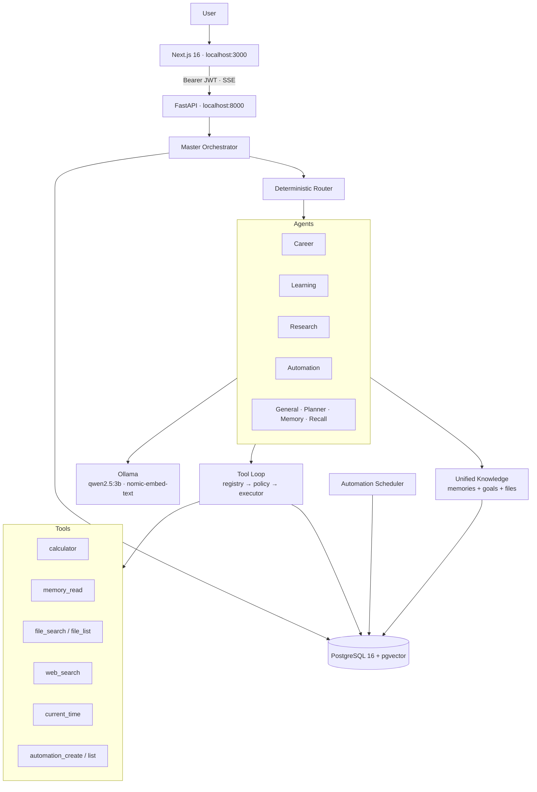

# GUMMY OS

> A local-first personal AI operating system: persistent memory, multi-agent
> orchestration, safe tool execution, and durable automation — running entirely
> on your own machine.

Your assistant is called **Gummy**. It learns useful things from your
conversations, keeps them in a local PostgreSQL database, and uses them quietly
— only when they bear on what you just asked.

**No Supabase. No Railway. No Vercel backend. No paid infrastructure.** One
Postgres container, one Ollama daemon, two dev servers.

---

## Status

| Area | State |
| --- | --- |
| Backend tests | **996 passed**, 4 skipped (Postgres-gated), 0 failed |
| Frontend tests | **18 passed**, 0 failed |
| TypeScript · ESLint | clean |
| `ruff` · `black` · `mypy app` | clean (241 source files) |
| `mypy tests` | 57 pre-existing errors — [reported, not hidden](docs/VERIFICATION_REPORT.md#1-automated-checks) |
| Migrations | 25 Alembic revisions |
| API | 73 endpoints across 15 routers |
| Agents | 6 routed specialists + general + recall |
| Tools | 9 executable, 2 modeled behind approval |

Every number above was produced by running the thing. See the
[Verification Report](docs/VERIFICATION_REPORT.md) for exact denominators.

---

## Architecture



Every agent shares **one** memory engine, **one** knowledge seam, **one** tool
loop, and **one** orchestrator. Agent identity lives entirely in prompts.

---

## What works

### Memory
Facts are extracted from conversation automatically, consolidated against what
is already known (restatements reinforce; more specific versions supersede), and
retrieved by hybrid ranking — semantic similarity blended with importance,
confidence, and recency.

**Memory stays silent unless relevant.** A measured **0.45 semantic floor**
(calibrated against the real embedding model, not guessed) keeps unrelated
memories out of the prompt entirely, and the prompt tells the model to use
context without announcing it. Ask *"what is the capital of France?"* and zero
memories are injected.

**Instant recall** answers direct questions about stored facts with no model
call at all — sub-second, versus ~3 s generated.

### Agents
Career · Learning · Research · Automation, plus Planner, Memory, General, and a
deterministic Recall agent. Routing is keyword-based, free, and needs no LLM.

**Requests are routed into one of three shapes**, decided grammatically
rather than by keyword counting:

| Shape | Example | What runs |
| --- | --- | --- |
| **SINGLE** | *"Find AI/ML jobs and internships"* | Career only — one task phrased twice |
| **PIPELINE** | *"Find AI jobs **and then** a plan for my biggest gap"* | Career → Learning, findings handed forward |
| **PARALLEL** | *"Find AI/ML jobs **and** research AI agent companies"* | Career ‖ Research, then synthesis |

PIPELINE is the default of the two multi-agent shapes: running independent work
sequentially is merely slower, while running dependent work concurrently means
the second agent answers without what it was supposed to receive. So
independence must be shown — a neutral connective and no back-reference. A
phrase like *"research **the companies**"* points at the previous clause's
result and stays a pipeline.

Measured live: two branches that each take ~10 s **finish 17–19 ms apart**,
against a 19.06 s finish spread for the same pair run as a pipeline.

### Research evidence

**No evidence, no claims about the present.** A question that depends on
current information — "the latest…", "what's new in…", "who is hiring", prices,
versions — is answered with an honest notice when no live results back it,
never from model memory dressed up as a finding.

Search reports *why* it has nothing, and the four reasons are not
interchangeable:

| Status | Meaning | What the user is told |
| --- | --- | --- |
| `AVAILABLE` | live results returned | the answer, with sources |
| `UNAVAILABLE` | no provider configured | "Live web search isn't configured on this GUMMY instance" |
| `FAILED` | provider errored | "I couldn't reach live web search just now" |
| `NO_RESULTS` | searched, found nothing | "Live web search returned nothing for this" |

The notice is appended **by code**, not requested from the model — a prompt
instruction is advice a small model can drop, and the user must never be left
believing an unverified answer was checked. Timeless questions ("What is RAG?",
"Compare RAG and fine-tuning") get no notice and no search: over-warning trains
people to ignore the warning.

**Career never invents openings.** Without live evidence it works on the
resume, names target roles and skills, supplies search terms and boards, and
prepares for interviews — but does not claim any company is hiring.

### Tools
A registry → policy → executor path with Green/Yellow/Red tiers, JSON-Schema
validation, per-tool timeouts, a 4-iteration loop cap, and redacted audit rows.
The calculator parses with an AST allowlist — `eval` is never used, so
`__import__('os').system(...)` is rejected at parse level.

### Automation
Reminders and recurring check-ins persisted in PostgreSQL, **surviving a
restart** — verified by restarting the backend and re-querying. Duplicate
execution is prevented by a unique constraint, not by careful sequencing.

They run inside GUMMY and **do not send email or create calendar events.**

### Authentication
GUMMY is its own identity provider: HS256 JWTs, PBKDF2 at 600k iterations,
rotating hashed refresh tokens, and Row-Level Security on all 25 tenant tables.
Verified live: **26/26** checks including two-user isolation.

**Password recovery works offline.** Reset tokens are stored only as a SHA-256
hash, are single-use, expire in 45 minutes, and revoke every session on the
account when redeemed. `forgot-password` returns a byte-identical response for
known and unknown addresses, so it cannot be used to discover who has an
account. With no email provider configured the reset link is written to the
backend log tagged `[GUMMY AUTH]` — the whole flow is testable locally, and
nothing ever claims an email was sent when none was. Verified live: **19/19**,
plus the full browser round trip.

---

## Running locally

**Local development only.** There is no public deployment — GUMMY runs on your
machine by design, because the point of the product is that your memory never
leaves it. The URLs below are not reachable by anyone else.

### Prerequisites
Docker · Python 3.12 · Node 22 · [Ollama](https://ollama.com)

```bash
ollama pull qwen2.5:3b
ollama pull nomic-embed-text
```

### Start

```bash
docker compose up -d
```

```bash
cd backend && cp .env.example .env && uv sync && uv run alembic upgrade head && uv run uvicorn app.main:app --reload
```

```bash
cd frontend && npm install && npm run dev
```

| | URL |
| --- | --- |
| App (local) | **http://localhost:3000** |
| API (local) | **http://localhost:8000** |
| Swagger | **http://localhost:8000/docs** |
| Health | **http://localhost:8000/health** |

### Environment

Everything required is local. All external providers are optional.

| Variable | Purpose | Required |
| --- | --- | --- |
| `DATABASE_URL` | App connection (`gummy_app`, RLS-enforced) | yes |
| `DIRECT_DATABASE_URL` | Migrations + auth (owner role) | yes |
| `GUMMY_JWT_SECRET` | Token signing | yes |
| `LLM_PROVIDER` / `OLLAMA_MODEL` | Defaults to local Ollama | — |
| `EMBEDDINGS_PROVIDER` | Defaults to `nomic-embed-text` (768-d) | — |
| `GUMMY_OWNER_MODE` | Skips the login screen — **also disables sign-out** | leave `false` |
| `GOOGLE_CLIENT_ID` / `_SECRET` | Enables the Google button | optional |
| `AUTH_EMAIL_MODE` | `console` (log the reset link) or `smtp` | — |
| `SMTP_*` | Real email delivery, only when mode is `smtp` | optional |
| `BRAVE_API_KEY` | Enables live web search (with `AGENTS_WEB_SEARCH_ENABLED=true`) | optional |
| `OPENAI_API_KEY` / `ANTHROPIC_API_KEY` | Alternative model providers | optional |

Never commit `.env`. `.env.example` carries empty placeholders only.

---

## Documentation

| Document | Contents |
| --- | --- |
| [Verification Report](docs/VERIFICATION_REPORT.md) | Every metric, with commands and denominators |
| [Authentication](docs/AUTHENTICATION.md) | Sessions, sign-out, Google OAuth, isolation |
| [Agent Workforce](docs/AGENT_WORKFORCE.md) | The four agents and durable automation |
| [Multi-Agent Delegation](docs/MULTI_AGENT_DELEGATION.md) | Compound routing and hand-offs |
| [Tool System](docs/TOOL_SYSTEM.md) | Registry, policy, executor, the loop |
| [Architecture](docs/GUMMY_OS_ARCHITECTURE.md) | Layer-by-layer (M8.5 history) |
| [Résumé Summary](docs/RESUME_PROJECT_SUMMARY.md) | Positioning and talking points |
| [Roadmap](docs/FUTURE_ROADMAP.md) | What comes next |

Documents numbered `01`–`10` are release notes and describe the state at the
time they were written.

---

## Limitations

Stated plainly, because a README that hides these is not useful.

- **Google sign-in is configured but the round trip is untested.** The backend
  reports it available and `/auth/google/start` redirects to Google correctly;
  completing the flow needs a real Google account sign-in, which was not done.
- **File retrieval is keyword-based.** There is no vector RAG over file chunks.
- **Live web search is not configured on this machine.** `BraveSearchProvider`
  is implemented and wired; without `BRAVE_API_KEY` the offline placeholder
  stays installed and every current-information question is answered with an
  explicit "I can't verify this" rather than a guess.
- **Auth email is console-mode locally.** SMTP is implemented and unit-tested,
  but no real send has been performed from this machine.
- **No rate limiting** on login or forgot-password — local-only concerns today.
- **Automations run only while GUMMY is running**, and there is no notification
  channel — a fired reminder appears in the Automations panel.
- **No connectors.** Gmail, Calendar, GitHub, Slack are not implemented; only
  `.ics` calendar import exists.
- **No public deployment**, and no cloud infrastructure.
- **Tokens live in localStorage**, a deliberate trade for the `:3000`→`:8000`
  split.

---

## Roadmap

1. **Vector file RAG** — `file_chunk_embeddings` mirroring the proven
   `memory_embeddings` HNSW pattern.
2. **Model gateway tiering** — per-call provider selection; `qwen3:8b` is
   already on disk as the local complex tier.
3. **Connector credentials** — an encrypted token store, unblocking Gmail and
   Drive.
4. **LangGraph**, evaluated only once the tool loop and delegation are proven.

---

## Stack

Python 3.12 · FastAPI · SQLAlchemy 2.0 async · Alembic · PostgreSQL 16 ·
pgvector · Ollama · Next.js 16 · React 19 · TypeScript · Tailwind v4 ·
TanStack Query

---

## License

MIT — see [LICENSE](LICENSE).
